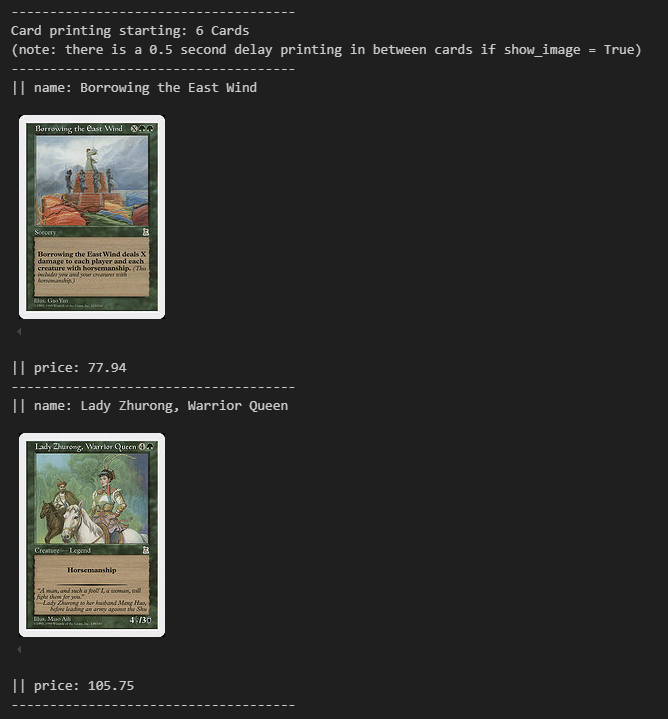

# Scryfall-API-Methods

## Introduction:
See my mtg-script-notebook.ipynb for a look at some basic methods I've developed to handle Scryfall API data and packaging it all into pandas dataframes (among some other methods).

Download the methods my_scry.py file from here: https://github.com/JsonBravo/Scryfall-API-Methods/blob/main/my_scry.py 

The Scryfall Website: 
*https://scryfall.com/*

## Outline of Methods:

### Pulling JSON Data with the API:
* **`bulk_oracle_scry`**: A single pull of all single cards (most recently printed in the case of reprints) using the `bulk_oracle_scry` method (bulk oracle data is updated in Scryfall daily). This is a good choice if you are looking to do a deep analysis for deckbuilding across multiple colors / formats.
* **`scry`**: A pull of cards which fit a specified query using the `scry` method (query syntax is outlined here: https://scryfall.com/docs/syntax).

### Packaging into a Dateframe

#### Considerations and Caveats - The "Scryframe"
* Multi-face Cards: Each multiface card will be put into a single row for each face, plus one additional row representing the card as a whole. These rows will share the same id. 

* Standard Price: The minimized scryframe will only return one price. The price selection is prioritized as follows (the first one found is selected as the `standard_price`): `usd` > `usd_foil` > "the average of all prices available" > `0.00` 

#### Extra Method - Pretty Print
* I've included an additional method that is usefull for printing out specific card data (including the card image):

*Example*:

`pretty_print(df=my_scry[['name','image_uris','price']], show_images=True, image_size='small')`

